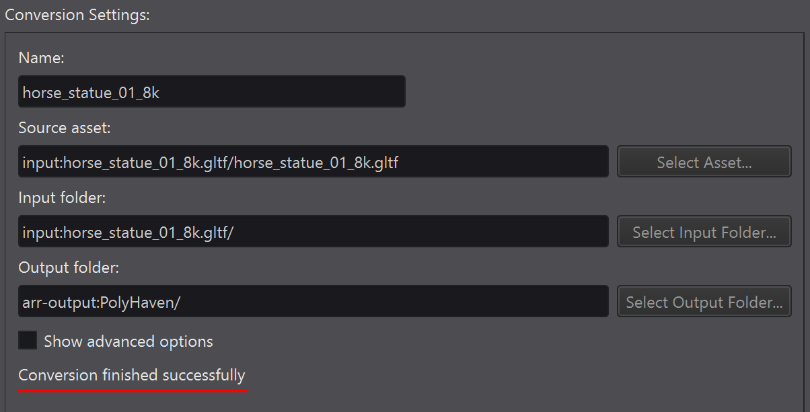

# Converting models with ARRT

Under the *Conversion* tab you can convert a model from a source asset format to the internal `.arrAsset` format needed by Azure Remote Rendering. ARRT simply gathers the information and forwards it to the ARR model conversion service. Thus all conversions run in the background in the cloud. Details on supported file formats, pricing and so on, [can be found here](https://docs.microsoft.com/azure/remote-rendering/how-tos/conversion/model-conversion).

## Starting a conversion

Click the entry **new conversion** on the left hand side. On the right, you have to select two paths:

1. The *source asset*, which is the file that you want to convert.
1. The *output folder*, which is where the converted model shall be stored.

The output file will be called *[name].arrAsset* with *name* being taken from the *Name* text box. If you don't provide a custom name, the filename of the source asset is used by default.

Usually this is already sufficient, and you can click **Start Conversion**. Once started, the conversion shows up as its own entry in the list on the left. Both the list and the statusbar indicate how many conversions are currently running.

## Advanced conversion options

Click *Show advanced options* to see additional conversion options.

The effect of the various options is [documented here](https://docs.microsoft.com/azure/remote-rendering/how-tos/conversion/configure-model-conversion).

The configuration is written to a file named "[source-asset].ConversionSettings.json" next to the source asset file.

## Conversion result

If a conversion fails, any error message is displayed under the conversion settings:

Also, the conversion service always writes a `[name].info.json` and a `[name].result.json` file into the output folder. These files contain additional information about errors or potential problems. It is a good idea to inspect these files.
