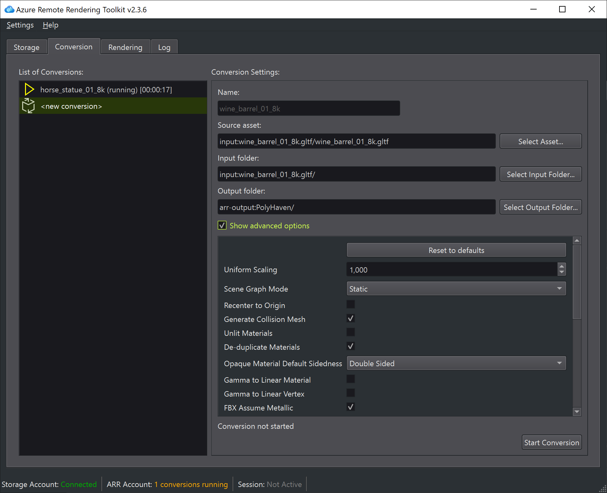

# Conversion in Azure Remote Rendering asset tool

To access the conversion environment, click on the button on the top toolbar.
To convert a file, click on "New". Now the view is split between a conversion list on the left side, and the conversion configuration panel on the right side. Follow these steps to configure your new conversion:

## Input model selection

If you click on the button "Select" on the right of the input field, a panel will show the content of your blob storage. To choose the model to convert, first choose the blob container, then select an input model.

The blob list visualization has two modes:

* When **show all models** button is selected, all of the models will be shown in a flat list. If a directory is selected, then the list will be filtered with only the models in that directory or subdirectories. The list shows just the valid 3d file input formats (FBX, GLFT, GLB).

* When **show all models** is not selected then the list will show only the content of the selected directory, with all of its blobs and subdirectories. You can double-click on the folders to navigate into them, like a file explorer, and find your model.

## Input root directory selection

The root directory is the one under which the input model and any file referenced by it (for example textures files) will be located.
Before starting the conversion, all of the files in the chosen root and its subdirectories will be transferred to the conversion service.

 By default this directory is set to the model directory. Make sure to select a higher-level root if you know that some referenced resource is outside of the model directory.

## Conversion configuration parameters

If the input model has been selected, you can visualize and edit all of the parameters for your conversion. See the page [Configure the model conversion](https://docs.microsoft.com/azure/remote-rendering/how-tos/conversion/configure-model-conversion) for more information on each parameter.

The configuration is written to a blob named "ConversionSettings.json" and stored on the input directory.

## Output directory selection

At the bottom of the conversion panel you can select the output directory (click on "Select" on the right side of the output field).

The panel is similar to the input panel, but it will show you just the sub-directories in the current directory, or, if you click on "Show all" button, it will show also all of the other blobs.

To select a directory you can navigate to it and press "ok", or you can select a sub-directory and press ok.

Like for the upload panel, you can also select a new container by clicking on the "+" icon on the right of the container selector, or navigate to a new directory by clicking on the "Add Sub-Directory" button.

## Start conversion

Once everything is set up correctly, you can press the button "Start Conversion" in the bottom-right corner. The status of the conversion will change to "Converting" and, if successful, to "Completed".

You can create multiple conversions and run them at the same time. You can also rename them by editing the "Name" field, or delete them from the list when not running.
