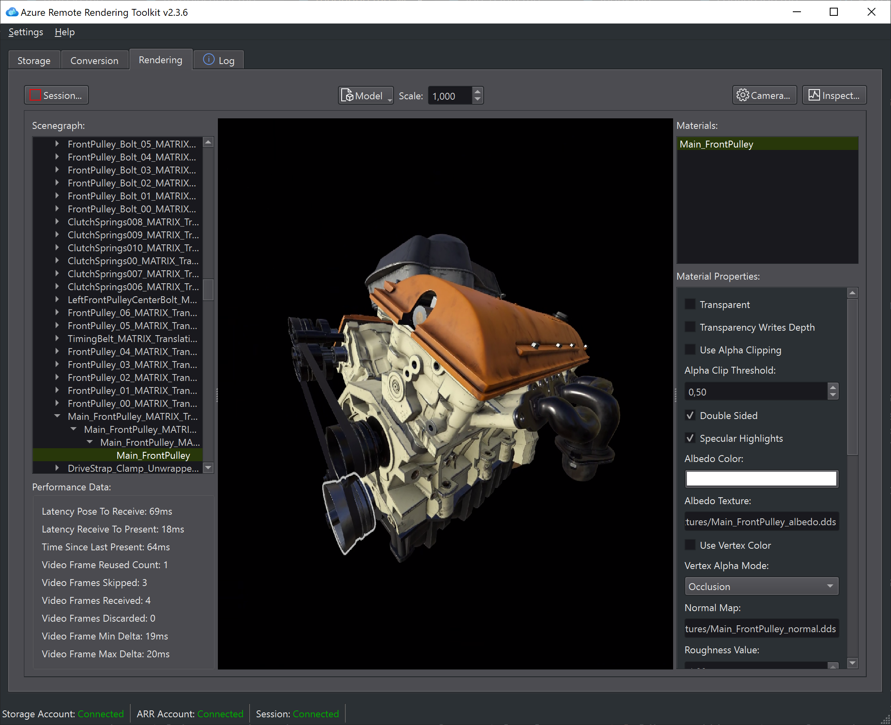
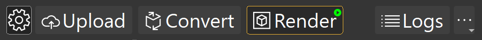

# Azure Remote Rendering asset tool (ARRT) user documentation

ARRT (Azure Remote Rendering asset tool) is an application using Azure Remote Rendering service to upload, visualize, and edit 3D models.

ARRT can be used by technical artists or contents creators to:

* convert 3D models (.fbx/.gtlf/.glb) to the ARR internal format (.arrAsset)
* start an ARR session to load
* render the model remotely
* modify its materials

## Setting up your accounts

To use ARRT, you can access the configuration panel by clicking on the gear icon on the toolbar.
You'll have to set up two subscriptions:

### Azure Remote Rendering subscription

If you don't have a subscription, follow the steps in [Create an Azure Remote Rendering account](https://docs.microsoft.com/en-us/azure/remote-rendering/how-tos/create-an-account#create-an-account).

Once you gain access to the subscription, you need to retrieve **domain**, **ID**, and **key** from your [account credentials](https://docs.microsoft.com/en-us/azure/remote-rendering/how-tos/create-an-account#retrieve-the-account-information) and enter them in the configuration panel.

### Azure Storage Account (for asset conversion)

To create an account, see [Create an Azure Storage Account](https://docs.microsoft.com/azure/storage/common/storage-account-create).

To upload files, you need one or more Blob containers in your storage account. See [Quickstart: Upload, download, and list blobs with the Azure portal](https://docs.microsoft.com/azure/storage/blobs/storage-quickstart-blobs-portal)

To find the credentials to enter in the ARRT configuration panel open the Azure portal and open your storage account. Look in "Access Key" and "Properties" under the "Settings" group on the left column. Find **Name**, **Key** under Access Key, and **Primary Blob Service Endpoint** under Properties.

An alternative way to configure your storage account is to use the [Microsoft Azure Storage Explorer](https://azure.microsoft.com/features/storage-explorer/)

## The main toolbar

All the main panels are accessible from the main toolbar on the top side.

From left to right you have:

* [Settings Panel](settings-panel.md)
* [Upload](upload.md)
* [Convert](conversion.md)
* [Render](rendering.md)
* [Log Panel](log-panel.md)
