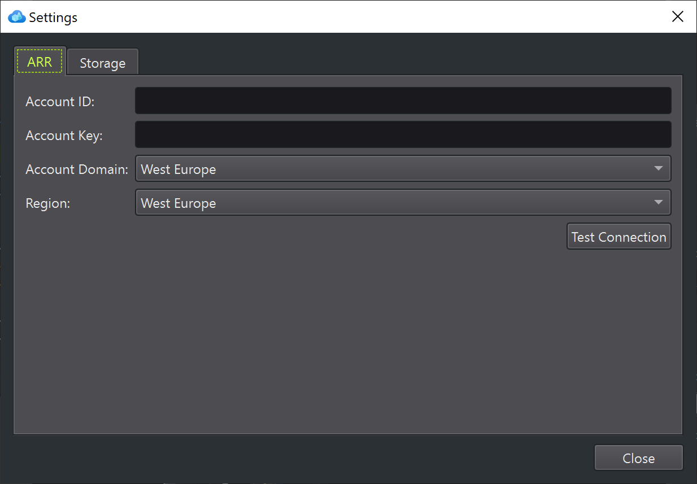

# Azure Remote Rendering Toolkit (ARRT) User Documentation

Azure Remote Rendering Toolkit (ARRT) demonstrates the functionality of [Azure Remote Rendering (ARR)](https://docs.microsoft.com/azure/remote-rendering). ARRT functions as a sample application as reference for how to integrate remote rendering into your own product. However, it can also be a useful tool to get basic tasks done, like uploading a source asset into Azure Storage or converting a model for remote rendering. As such it makes it much easier to get started with remote rendering.

## List of Features

These features are currently available in ARRT:

1. [Upload files](upload.md) into an Azure Storage account.
1. [Convert 3D models](conversion.md) (`.fbx`, `.glft`, `.glb`) to the ARR format (`.arrAsset`).
1. Start a new ARR session or connect to an existing one.
1. Control session duration (manual or automatic extension).
1. [Render converted 3D models](rendering.md) using ARR.
1. Select and highlight object parts through raycasting.
1. Edit material properties of selected parts.
1. Launch [ArrInspector](https://docs.microsoft.com/azure/remote-rendering/resources/tools/arr-inspector) for a running session.
1. See [log](log-panel.md) messages.
1. See basic performance numbers.

## Getting ARRT

To get ARRT, either download [a prebuilt package](https://github.com/Azure/azure-remote-rendering-asset-tool/releases), or [built it yourself](../README.md#building-arrt).

## Getting Started

To try out Azure Remote Rendering in general, you first need to have an Azure account and a Remote Rendering subscription. If you want to try it with your own 3D models, you also need to have Azure Storage.

### Azure Remote Rendering Account

If you don't have an ARR subscription yet, [follow the steps](https://docs.microsoft.com/azure/remote-rendering/how-tos/create-an-account).

### Azure Storage Account

To set up an Azure Storage account [follow these instructions](https://docs.microsoft.com/azure/storage/common/storage-account-create?tabs=azure-portal). Also see [this page](https://docs.microsoft.com/azure/remote-rendering/how-tos/conversion/blob-storage) for how to give your ARR subscription access to it.

An alternative way to configure your storage account is to use the [Microsoft Azure Storage Explorer](https://azure.microsoft.com/features/storage-explorer/).

### Configuring ARRT

When you launch ARRT and haven't configured the accounts yet, it will show a configuration dialog. This can also be opened from the main menu under *Settings > Account Settings...*

All the necessary login details can be found in [Azure Portal](https://portal.azure.com).

For remote rendering you need to enter the **Account ID** and **Account Key** of your ARR subscription. [This page](https://docs.microsoft.com/azure/remote-rendering/how-tos/create-an-account#retrieve-the-account-information) describes where you can find those.

You also need to select the **Account Domain**. This is the region where your ARR subscription has been created and will always stay the same no matter where in the world you want to use this ARR subscription.

Finally, you need to choose a **Region** where the ARR session should get hosted. Here you can select any option, but you should choose the one that is closest to your current location, as it determines how fast the rendered image can be sent to you.

For converting and rendering custom models, you also need to set up **Storage**. Here you need the **Name** and **Key** of your account, as well as the **Blob Endpoint**. The *name* is literally the name of the storage account (e.g. 'my-company-storage'). Both the name and the access key can be found in the *Access keys* area in Azure Portal. Your endpoint URL can be found in the *Endpoints* area in Azure Portal.

Click the **Test Connection** button to check whether the entered credentials are working.

ARRT remembers these settings and automatically connects to these accounts on startup.

### Using Remote Rendering (Quickstart)

Once the account configuration is successfully done, you can start your first rendering session.

On the **Rendering** tab, click the **Session...** button. In the dialog that opens, just click **Start**. The dialog will close and the statusbar will show that the rendering session is starting:

Once the session state changes to **Connected** it is ready for rendering. Click the button **Load Model with URL...** and in the following dialog keep the pre-filled URL and click *OK*. This loads the ARR sample model, which will take a while. Once this is done, the camera will center on the object. You can now fly around using the **WSAD** keys and rotate the camera via **right-click and drag** in the 3D viewport. Select object parts with **left-click**.

For more information, see the [rendering](rendering.md) page. To load a custom model, you first need to [upload](upload.md) it to your storage account and then [convert](conversion.md) it. In case anything goes wrong, you should find error messages in the [log](log-panel.md).

When you close ARRT, the session will automatically be stopped and not incur further costs.
