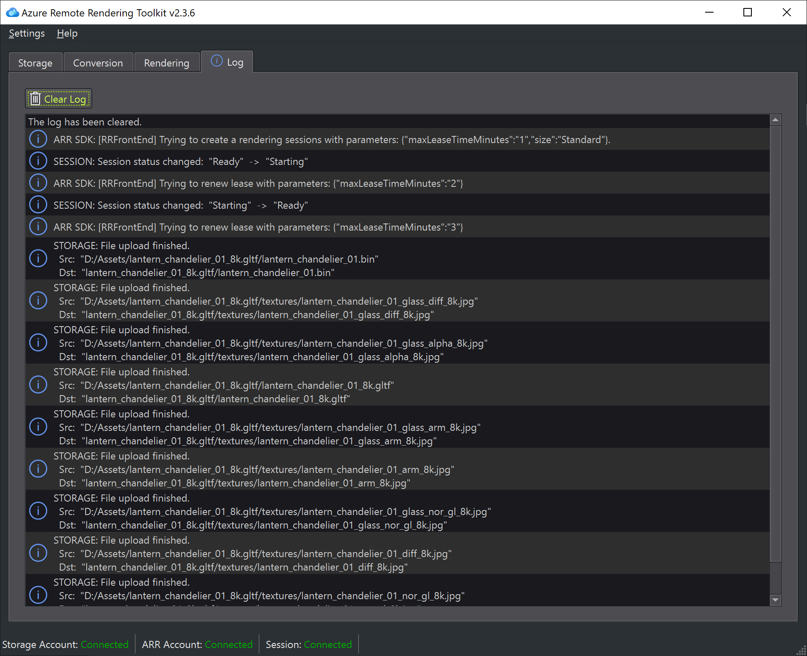

# Log panel

Many operations that interact with Azure services are asynchronous, which means that you don't get the result right away, but instead they are running in the background for a while. Although ARRT tries to present as much information as possible right away, some information will only arrive later.

ARRT displays such information and error messages in the log panel.

