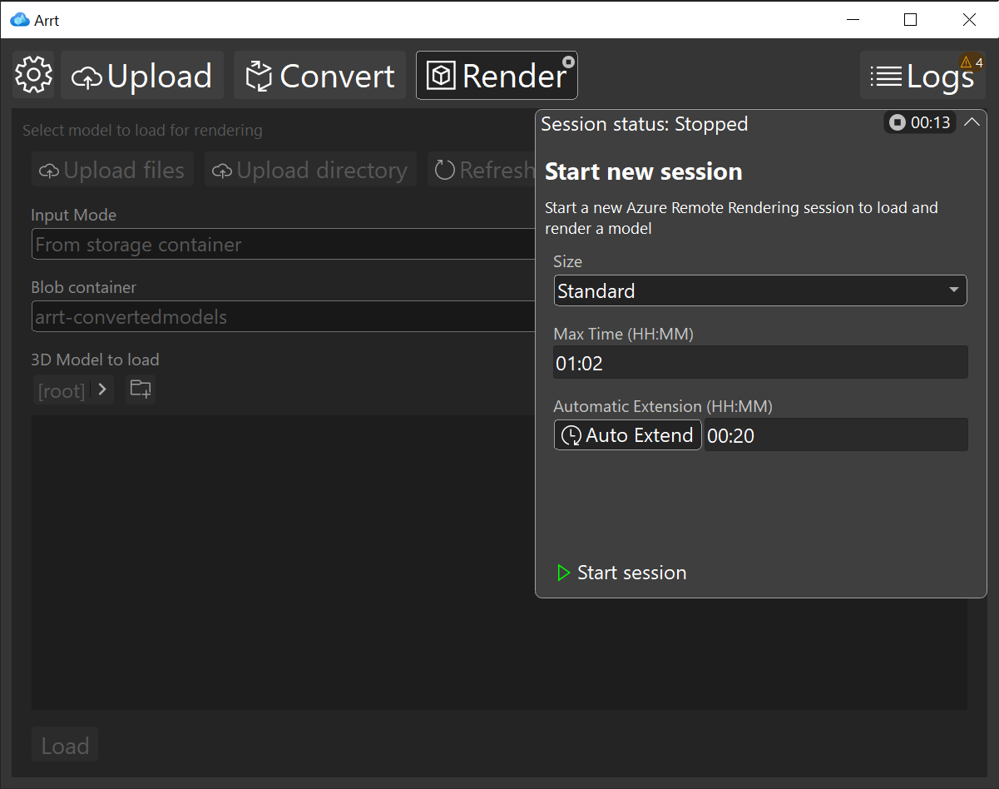
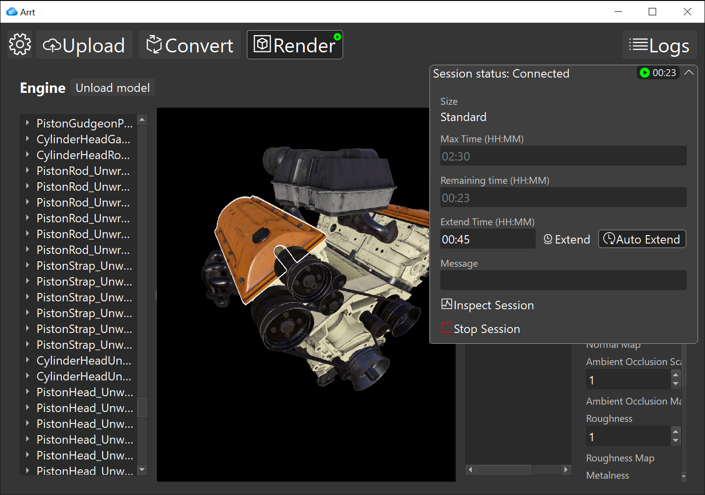
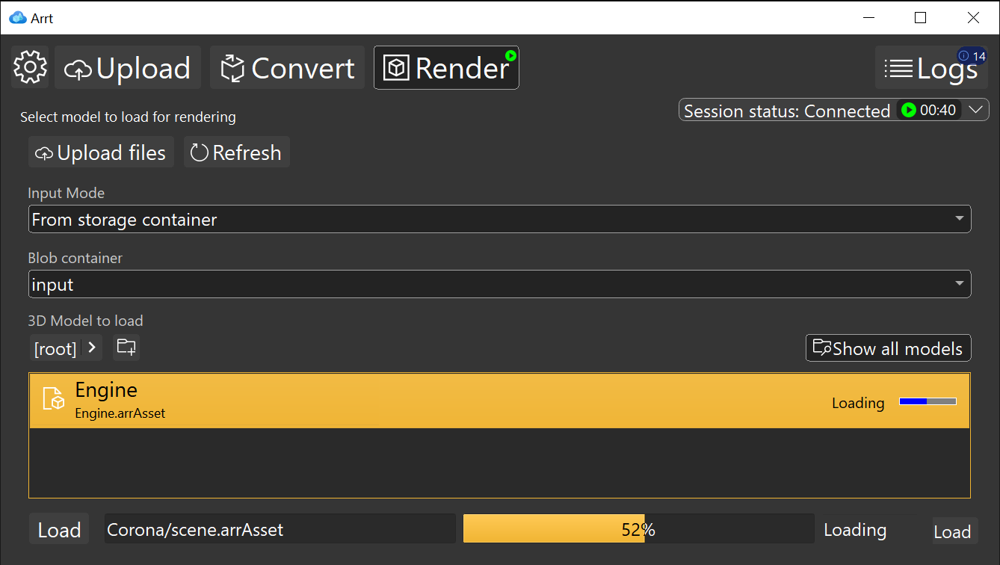
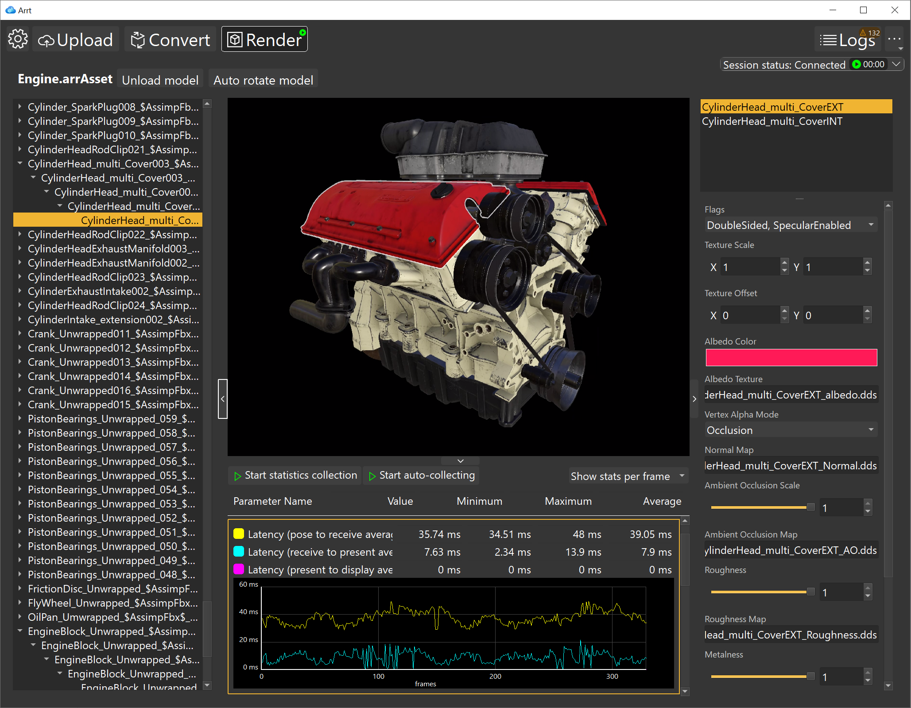

# Rendering

If you already converted an arrAsset model and you would like to visualize it, click on the "Rendering" button on the main toolbar.

You can also do that while conversions are running, as the two environments (Conversion/Rendering) run independently from each other.

The workflow to visualize and edit a model is made of three steps:

## 1. Start new session

To render a model, we need to start the ARR service, by creating a remote rendering session. If the session isn't running yet, clicking on "Rendering" will show the "session panel" on the right. From this panel you can select the parameters for a new session, like the VM size, the maximum lease time, and select an automatic lease extension. The lease time can be extended while the session is running.

The automatic extension option will make sure the session is automatically extended by the specified amount of minutes, if you get close to the expiration time while using ARRT. For more information on the session types, see [Create Session](https://docs.microsoft.com/azure/remote-rendering/how-tos/session-rest-api#create-a-session).

If you press the button "Start", a session will be created and automatically connected. This operation will require some time. Once the connection is established, this panel will collapse and the load model panel will become accessible.

### Visualize the session status

If the session is running, you can monitor its status by expanding the session panel anytime you need.

From the panel you can:

* visualize the status and configuration of the session
* extend the lease time by entering an amount of time, and pressing "Extend"
* set up an automatic time extension by clicking on "Auto Extend"

Whenever the session will be near expiration time, if "Auto Extend" is active the lease time will be extended by the amount of time entered in the text field.

> Note:
> the lease time cannot be reduced. Be careful when using the extend time function.

To have more details on the running session, you can click on "Inspect Session". This action will open the ArrInspector tool in a default browser. For more information about the ArrInspector, see the [ArrInspector tool documentation](https://docs.microsoft.com/azure/remote-rendering/resources/tools/arr-inspector).

The session can be stopped with the "Stop Session" button.

## 2. Load a model

Once the session is running, you have access to a panel to load a model. By using the combo box "Input mode" on the top of the page, you can select one of the two ways to load a model:

* From **storage container**. This option uses a blob explorer similar to the one used in the conversion configuration. You can locate a model and double-click it.
* From **SAS Url**. In this panel you can simply paste a SAS URL of your model. For more information about SAS URLs, go to [Grant limited access to Azure Storage resources using shared access signatures (SAS)](https://docs.microsoft.com/azure/storage/common/storage-sas-overview).

While the model is loading, you can see the status and the progress bar on the bottom.

## 3. Visualize the model

If the model is loaded correctly, the model will be shown in a new view. On the top the model name is visualized, and a button allows you to unload the model.
In the view there are four vertical panels, which can be resized vertically. From left to right:

### Scene tree

This panel shows a tree view with the hierarchy of all the entities in the loaded model. You can expand every node, and select them.

### Viewport

The viewport shows the rendered model, streaming it from the ARR service. The camera controls are:

* WASD keys or arrow keys to move the camera on the horizontal plane
* QE keys, +- keys, or Page Up and Page Down keys to move the camera vertically
* Right mouse button, 4682 keys, Insert Home Delete End keys, or ZXFC keys to rotate the camera
* SHIFT modifier to increase the camera movement speed by a factor of 10

Entities can be selected by clicking on them on the viewport. When you select an entity from the viewport, the corresponding entity gets selected and highlighted in the scene tree, and the other way around.

### Material list

This panel shows a list of the materials in the selected entities, or, if there's no selected entity, it shows the full list of materials. Materials can be selected with mouse click.

### Material properties

When a material is selected, this panel shows all of its editable properties. You can change properties (colors, parameters, flags) and see the results immediately reflected in the rendered model. There is no support for editing the material textures. For more information on the supported ARR materials, see [Materials](https://docs.microsoft.com/azure/remote-rendering/concepts/materials)
