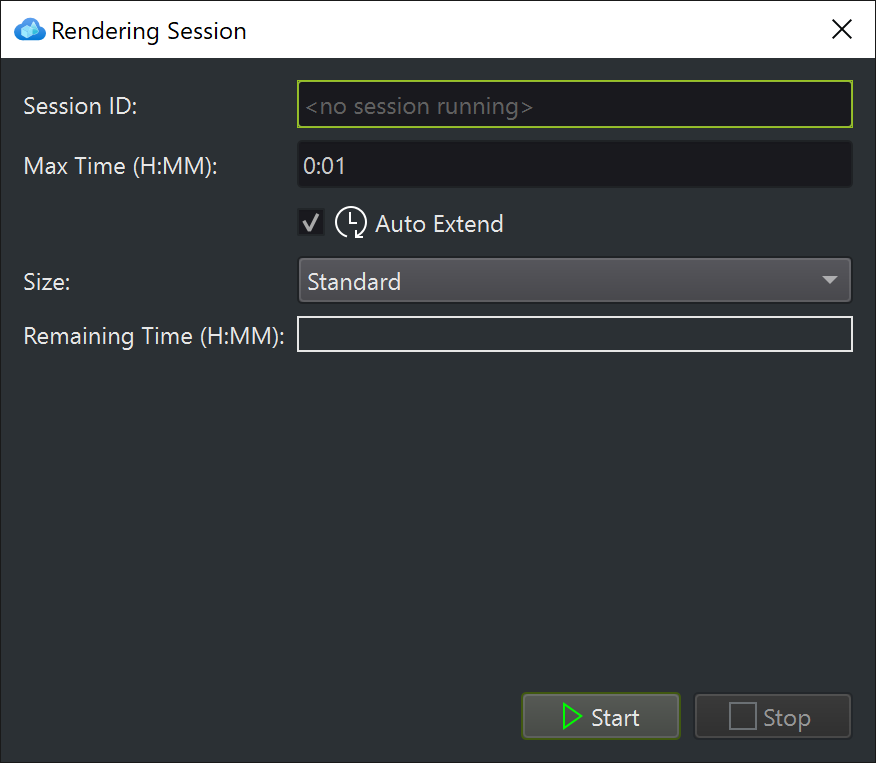

# Rendering

In the *Rendering* tab you can start a rendering [session](https://docs.microsoft.com/azure/remote-rendering/concepts/sessions), load models and edit their materials.

To load custom models, you first need to [convert them](conversion.md). However, if you have no converted model at hand yet, you can also just load the ARR sample model through a URL (see below).

## Controlling sessions

The **Sessions...** button in the top left corner opens this dialog:

Click **Start** to create a new session. If you already have a session running, you can also enter its *Session ID* here first, then *Start* will connect to the existing session.

Afterwards the dialog will close. You can reopen the dialog at any time with the *Sessions...* button. While a session is running you can change the auto-extension option.

You can also stop the session at any time. If you just close ARRT, it will automatically stop the session for you. If you click **Stop** yourself, you get the option to keep the session running, which allows you to reconnect to it again (though you need to note the session ID somewhere first).

Once you start a session, it can take some time for it to become fully available. The status is displayed in the statusbar at the very bottom. Once the green **Connected** state is shown, the UI allows to load models.

## Loading a model from a URL

Press the button **Load Model with URL...**. In the following dialog you can enter any [SAS URL](https://docs.microsoft.com/azure/storage/common/storage-sas-overview) to a converted asset in Azure Storage. You can generate such a URL with [Microsoft Azure Storage Explorer](https://azure.microsoft.com/features/storage-explorer).

However, you can also just keep the special URL **builtin://Engine** to load the standard sample model. This is the easiest way to see anything in ARRT, since you don't need to convert a model yourself to get started.

## Loading a model from Azure Storage

Press the button **Load Model from Storage...** and select a [converted](conversion.md) `.arrAsset` file from your connected storage account.

## Model rendering

Once a model is loaded, you will see it in the viewport:

## Camera controls

Press the **Camera...** button to open a dialog where you can configure the field-of-view, near and far plane, and camera movement speed. The dialog also displays how to control the camera.

## Scene tree

The scene tree on the left displays the structure of the loaded models. You can load multiple models simultaneously. Use the **Remove Models** button at the top to clear the entire scene. This is especially necessary, if the loaded models exceed the [limits of the rendering VM](https://docs.microsoft.com/azure/remote-rendering/reference/limits#overall-number-of-polygons). In that case you will only see a **checkerboard pattern**.

Select an item either through the tree or by clicking on it in the viewport. If you **double click** an item in the scene tree, the camera will focus on it. The same can be achieved by pressing the **F key** while the viewport has input focus.

## Model scale

Some models are very large, others are very small and yet others are very far away from the origin. ARRT attempts to detect extreme cases and notify you about it. In any case, you can always use the **Model Scale** option from the toolbar to adjust the size of the loaded models. Also change the camera movement speed as necessary and make sure the near and far plane are configured accordingly.

## Material editing

When an object is selected, the list on the right hand side shows all the available materials. You can edit any material and see the effect live in the viewport. More information on materials is available [in the ARR documentation](https://docs.microsoft.com/azure/remote-rendering/concepts/materials). Note that there are two types of materials: [PBR materials](https://docs.microsoft.com/azure/remote-rendering/overview/features/pbr-materials) and [color materials](https://docs.microsoft.com/azure/remote-rendering/overview/features/color-materials), which is why you will see different options in the UI depending on the selected material type.

> **Note:**
>
> Material changes are not saved. Any change you do to a material will be lost once you stop the session (or even unload a model) and will not propagate to other sessions.

## ArrInspector

You can launch [ArrInspector](https://docs.microsoft.com/azure/remote-rendering/resources/tools/arr-inspector) for your session with the button in the toolbar. ArrInspector is a great tool to live inspect performance stats and capture traces for debugging.

## Performance statistics

In the bottom left corner ARRT displays some performance stats that are available through the ARR API. These values are also available in ArrInspector, where you can plot them on a graph.
