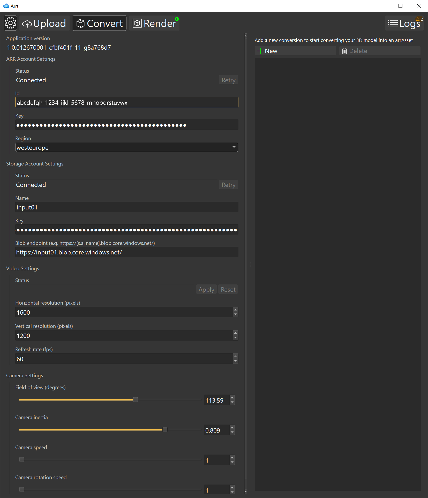

# Settings panel

To access the settings panel, click on the gear button on the top-right corner.

The panel allows you to change the following settings for ARRT:

* Remote Rendering account.
* Blob storage account. For instruction on how to set up your ARR and Blob storage accounts, see [Setting up your accounts](index.md#setting-up-your-accounts)
* Video settings, like the video resolution, fps, and the navigation controls.

> [!NOTE]
> To apply a different video resolution and fps on a running session, you can press the button "Apply" after making the changes. This will force a reconnection to the runtime, which will unload any model that is currently loaded.

All of the changes are immediately applied after editing.

The configuration is persisted in a json file stored in *%LocalAppData%/Arrt/config.json*
