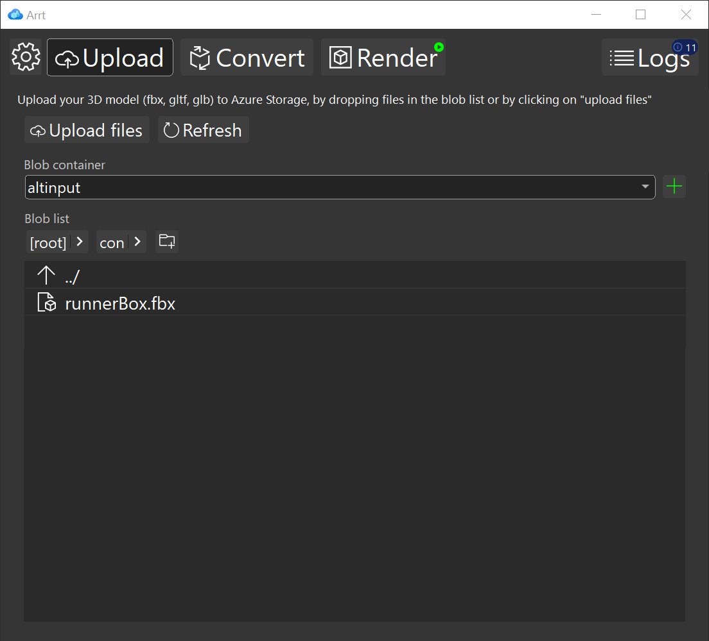

# Upload models in Azure Remote Rendering asset tool

To convert a 3D model, first it has to be uploaded to one the containers in your Azure Storage account. To do so, click on the "upload" button on the main toolbar.
Select the container where you want to upload the model using the combo-box on the top.

## Selection of the destination directory

To select a destination directory, you can navigate to it by double clicking on in the blob list. Alternatively, you can click on the right arrow on one of the directory buttons, to navigate to one of its sub-directories.

To select a new directory, click on the "Add Sub-Directory" button, with a folder and a plus sign, enter the name of a new directory and press enter.

## Upload

To upload files from your local hard drive into the current root directory, you can:

* drag and drop the files directly into the list
* click on the "Upload files" button on the bottom. From that file dialog you can multi-select files and directories, which will then be transferred to your blob container.
