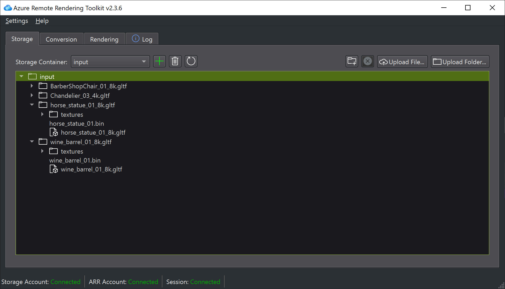

# Uploading files with ARRT

The [conversion](conversion.md) service needs all data to be located in an Azure Storage container to read from. Therefore, you have to upload your assets into Azure Storage to convert them.

The *Storage* tab displays the content of your storage account:

At the top you can switch between different storage containers. The tree view displays the file structure within that container. The right-most buttons allow you to create new folders, delete files or folders and upload files or entire folders. These actions all operate on the file or folder that is currently selected in the tree view.

The statusbar displays how many files are still left to upload.

Be aware that when [converting](conversion.md) a model, the conversion service will download an entire folder, with all files in it, not just the source asset file. Therefore it is very much advised to create a dedicated folder for each asset and its dependent input files, otherwise the conversion service may need to download much more data than necessary, which can waste a lot of time or even fail.
